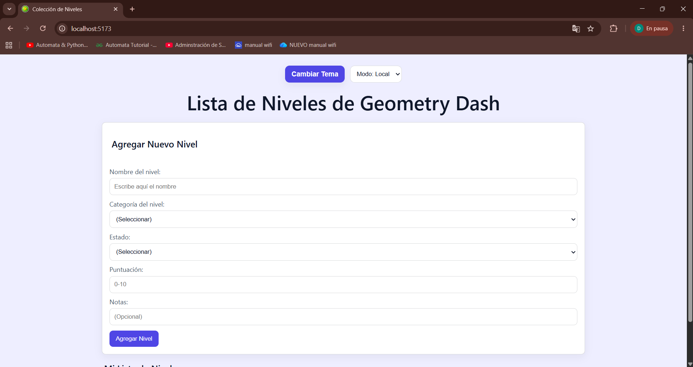
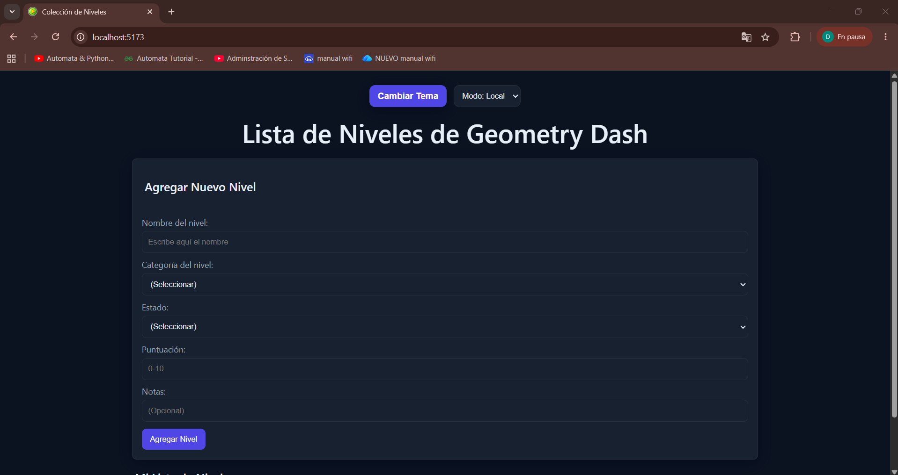
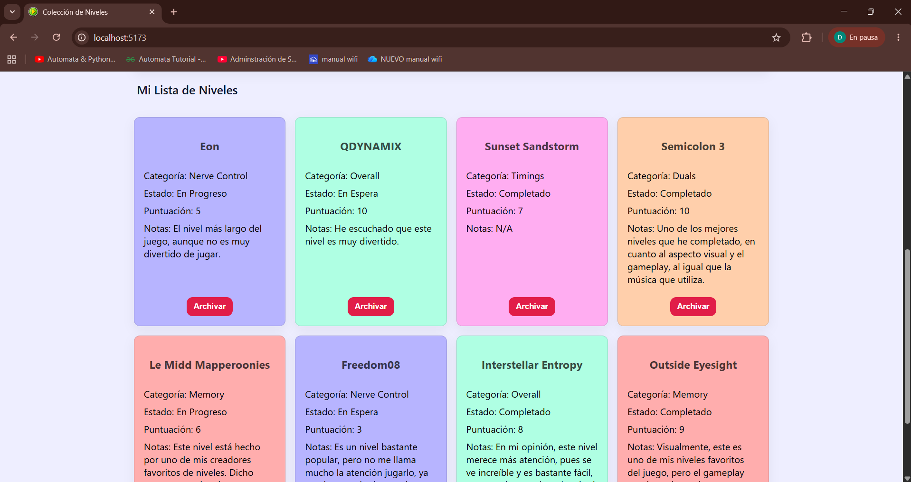
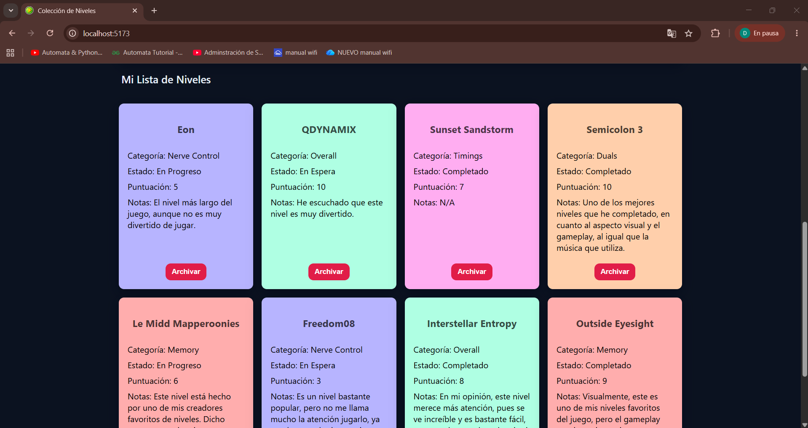

<h1 align="center">Proyecto Final: Sistemas y Tecnologías Web</h1>

<h2 align="center">Tracker de Niveles de Geometry Dash</h2>

<h3>Descripción</h3>

Esta es una aplicación web que manejará una colección de niveles a completar en el videojuego "Geometry Dash". El usuario podrá crear registros para cada nivel, permitiéndo una customización que se adapte a sus preferencias.

<h3>Funciones y Atributos</h3>

Cuando se crea un registro, se definen varios atributos para el nivel que se desea agregar/modificar. Por ejemplo:

<ul>
    <li>Nombre del Nivel</li>
    <li>Nombre del Creador</li>
    <li>Nivel de Dificultad</li>
    <li>Tiempo Jugado</li>
    <li>Categoría de Habilidad</li>
    <li>Duración del Nivel</li>
</ul>

Además, se podrá manejar el progreso obtenido en cada uno de los niveles registrados. Cada nivel registrado cae en una de las siguientes categorías:

<ul>
    <li>Completado</li>
    <li>En Progreso</li>
    <li>En Espera</li>
</ul>

<h3>Instrucciones</h3>

Para correr la aplicación localmente en tu dispositivo, se debe clonar el repositorio. Para esto, ejecuta los siguientes comandos en tu terminal en la ubicación que deseas crear el directorio:

<pre>
git clone https://github.com/DiegoRizzo/Proyecto2-STW.git
cd Proyecto2-STW
</pre>

Después de clonar el repositorio, dirígete al directorio <code>backend</code> para instalar las dependencias necesarias. Ejecuta los siguientes comandos:

<pre>
cd backend
npm install
</pre>

En el directorio <code>backend</code>, se debe inicializar el servidor para el API. Para esto, se puede ejecutar cualquiera de los siguientes comandos:

<pre>npm start</pre>
<pre>node src/index.js</pre>

Ahora que está corriendo el servidor del backend, es necesario abrir otra terminal para correr el servidor del frontend. En tu nueva terminal, dirígete al directorio <code>frontend</code> del proyecto. Aquí, es necesario instalar dependencias nuevamente, utilizando los siguientes comandos:

<pre>
cd frontend
npm install
</pre>

Finalmente, para tener lista la aplicación de manera local, se debe inicializar el servidor para el frontend, ejecutando el siguiente comando:

<pre>npm run dev</pre>

Ahora tienes tus dos servidores corriendo localmente. El servidor del backend estará corriendo en el puerto 3001, mientras que el servidor del frontend estará corriendo en el puerto 5173.

<h3>Funcionamiento del App</h3>

Así se ve la aplicación inicialmente, en temas claro y oscuro, respectivamente:

Así se ve la aplicación con varios registros de niveles creados, en temas claro y oscuro, respectivamente:

Creado por Diego André Chún Rizzo - 22955
